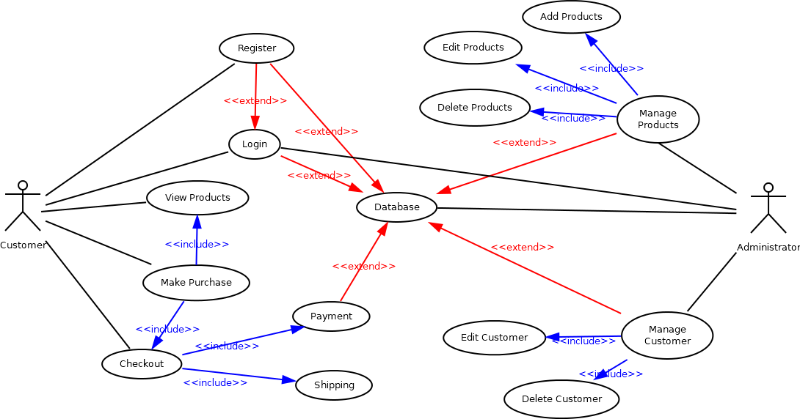
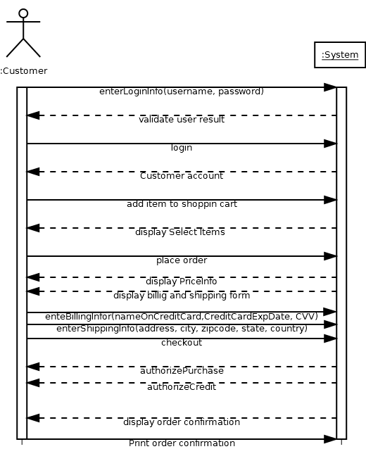
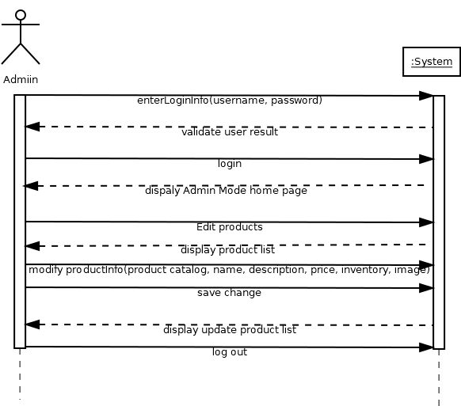
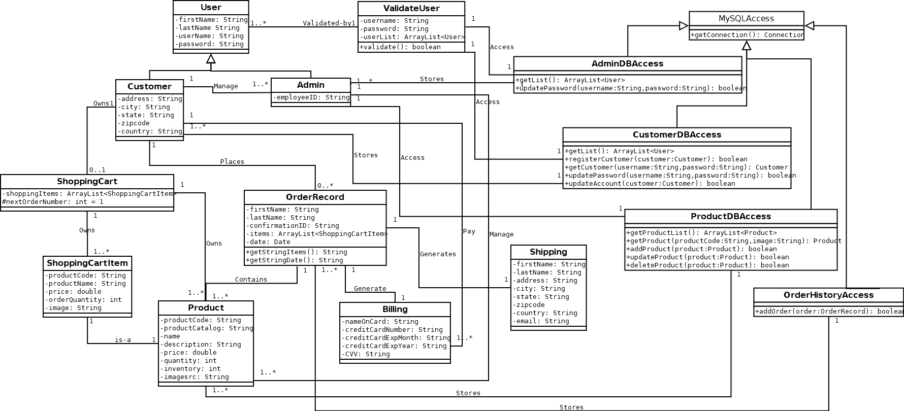
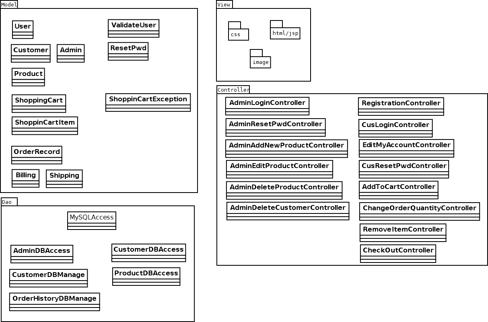

# CoffeeGo-Web-App
Project X [UCSC Silicon Valley Extension: Object-Oriented Analysis and Design]

## Project Overview
### Project Description
- Design a web store compelete with products, reviews, ordering capabilities with GRASP principles. 
- Use web server Apache to host the web
- Manage dataset using MySQL

### Project Procedure
- Create a brief and a fully-dressed use cases
- Draw interaction/sequence diagrams
- Draw UML diagrams
- Draw architectral diagrams
- Write software code in Object Oriented language
  - JAVA

### Project Results
- Use case diagram


          
- Interaction/sequence diagrams




- UML class diagram


          
- Architecture diagram



## Getting Started
### Prerequisites
- [Apache Tomcat v9.0](http://tomcat.apache.org/)
- [Eclipse](https://www.eclipse.org/downloads/)
- [MAMP](https://www.mamp.info/en/)

## Install  
[Apache Tomcat Server in Eclipse IDE](https://crunchify.com/step-by-step-guide-to-setup-and-install-apache-tomcat-server-in-eclipse-development-environment-ide/)

### Run

- Apache server
```bash
localhost:8080/
```

- MAMP
```bash
http://localhost:8888/MAMP/index.php?language=English
TOOLS tab --> PHPMYADMIN
```

- CoffeCoWebApp
  - import CoffeCoWebApp folder to Eclipse
  - right click file `home.html` in `WEB-INF` folder
  - Run As --> Run on Server --> Finish

